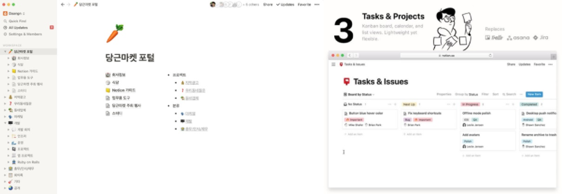

###  ✨ 우아한형제들크러닝 4기 "나만의 노션 만들기 (feat.시니어봇)" 
---
#### 기술 스택

#### 초기 작업환경 세팅

> 리엑트, 타입스크립트

> node.js 설치 (npm)

#### 목표

> 노션 클론 코딩하기

#### 노션이란 ??

 

> 노션은 원페이지 협업툴의 유형을 갖춘 서비스다. 
> 한 페이지에서 일정, 할 일, 파일, 커뮤니케이션을 주고 받고 외부 서비스 데이터를 끌어와 문서화 시킬 수 있는 기능도 갖추고 있다. 
> 어떤 방식이든 ‘한 페이지’에서 여러 명이 함께 업무를 정리할 수 있는 장점으로 주목받고 있는 툴이다.

> 이는 두 가지 측면에서 효과가 있다. 

> 첫 번째 업무 흐름을 투명하게 기록하면서 가시성을 확보해 비대면 상황에서 업무 공유를 원활하게 한다. 
> 두 번째 메신저나 타 서비스 이용이 줄어들면서 컨텍스트 스위칭(Comtext Switching)이 최소화된다. 

> 국내에서는 노션 외에도 유일하게 구축 형태를 제공중인 콜라비(Collabee)도 사용자가 늘고 있는 추세다. 
> 협업툴 시장에서 원페이지 협업툴의 성장 속도는 이전의 협업툴과 비교할 수 없을 정도로 빠르다. 
> 원문 링크(https://platum.kr/archives/163373)

#### 교육내용

 <b>1주차 (1) (06.01.21)</b>

 
 <b>김민태 기술이사님과 함께한 오리엔테이션(OT) </b>  
 <b>질문 4가지?</b>  
 

  <b>1. 시니어가 왜 필요할까? </b> 
 주니어 개발자들이란 경주마같다. 앞으로 달릴 수 있는 힘과 체력은 충분하지만 옆을 돌아보기란 어렵지 않을까?  
 시니어들이 방향성을 잡아 줄 수 있는 역할..? 문제해결에 충분한 경험이 있기 때문에..  
  <b>2. 실무적 코드란 무엇일까?</b> 
 유지보수가 쉬운 코드? 너무 추상적이라...  
 좀더 구체적으로 말해보자면, 직관적으로 이해가 가는..  
 프레임워크를 사용해서 쉬운 구조로 모듈을 구성하고 테스팅도 쉽게 해보는.. 그런느낌의 코드가 아닐까  
 사실 개발자로서 실무경험이 전무하다보니 실무적 코드에 대한 개념이 부족..  
  <b>3. HandsOn은 누가 잘하나?(하루에 다루는 코드량)</b> 
 사실 다루는 코드량이 많다고해서 일을 더 많이한다는 의미는 아닐듯 싶다.  
 물론 조금더 알기 쉬운 코드, 단순 반복 업무라고해서 쉬운 일은 아니겠지만 다루는 코드량 보다는 코드의 질이 더 중요하지않을까?  
  <b>4. 개발을 잘한다는 것은 무엇일까?</b> 
 사실 위의 질문과 본질적으로 비슷한 의미지 않을까 싶다. 개발을 잘하기 위해선 여러조건이 필요하다.  
 외적으로는 팀내의 커뮤니케이션, 업무 분담 부터 시작해서 코드작성 배포 등 여러가지로...  
 기본적인 기획적 확인사항부터 기술적인 확인사항까지 효율적으로 유연하게 진행하는 것이 개발을 잘하는 것일듯 싶다.. 
 

 

--- 

 <b> 1주차 (2) (06.03.21)</b>

 
 <b>“기획: 노션 만들기”</b>  
민태님께서 렉쳐를 진행하기에 앞서 두가지에 놀라셨다고 한다.  
첫 번째는 생각보다 많은 분들이 레포를 작성해주셨다고한다. 
아마 확인하신 것은  30개정도 된다고 하셨는데 시간적 여유가 하루밖에 되지 않 상황에서 40분 이상 작성..?  
두 번째는 몇분을 제외하고 나머지분들의 레포는 npx create-react 정도.. Hello! World! 라서 놀라셨다고 한다..  
이때 매우 뜨끔했다...  
전반적으로 consensus가 부족했던 탓이라고 하셨는데
사실 레포가 아쉽지 않았나 싶다..  
이런 류의 작업을 처음하다보니 무엇부터 해야할지를 몰랐다는..  
예를 들면 나만의 노션을 어떻게 만들것인가? 
목표 설정, 빌드 환경은…? 배포환경은..? 등과 같은 기술적인 확인사항, 기획적 확인사항에  
기초한 컨센이 없는 탓에 이를 위해서 기획단계에서 신경써야 할 부분에 관하여 피드백 해주셨다.  
대략 정리한 포인트는 3가지 정도로 이해했다. 
1. 목표 설정, 2. 기술적 확인사항, 3. 기획적 확인사항  
첫 번째는 목표 설정이다.  
간단하게 resource 적인 부분, public 또는 private 으로 회원으로 또는 비회원으로 구성할 것인가
 마크다운 기반의 문서인가 등의 부분을 point out 해주셨다.  
두 번째는 기술적인 확인사항이다.   
해본적이 있는(없는) 기술 난제가 있는지? 구현 시 시간은 얼마나 걸리는지..  
(시간적 제약)
빌드 환경은..? 배포 환경은 …? 코드의 규모 , 구조는..?  
기존의 방식을 그대로 구현할 것인지 혹은 다르게 시도해보고 싶은게 있는지? 등등이 필요한거같다.  
세 번째는 기획적 확인사항이다.  
poc? 혹은 prototyping? 만약 리팩토링 한다면 근본적인 이유는? 등이다.  
사실 각각의 개념에 대해선 조금더 공부가 필요할것 같다.  
렉쳐 초반에 김홍정님이 직접 정리한 레포를 발표했는데, 생각보다 많은 부분을 정리 해주셔서 공용레포로 선정되었다.  
하지만, 제안한 토스트 유아이가 마크다운 기반의 에디터이고 바닐라js 를 사용해야하는 탓에
draftjs와 slatejs를 추천해 주셨고,  
이에 관하여 개발자라면 내가 만든것은 무엇이라고 정의해야하는가, 개발원칙은..?  
등을 강조하셨는데 이에 대해 상당히 공감했다.   
결론적으로 해야할 부분을 point out 해주셨는데 이는 다음과 같다.   
우리의 노션은 회원서비스를 포함한 간단한 문서공유 서비스(단일파일 , 친구들 끼리 공유하는 수준)이다.  
다음 시간까지 구글 OAuth를 통해 아이디를 연동하고 slatejs 와 draftjs 기반의 간단한 프로토타입을 제작하여 공유하는..?   
다음 시간에는 작업한 레포에서 코드기반의 렉쳐를 하신다고 한다. 
 
 

---
